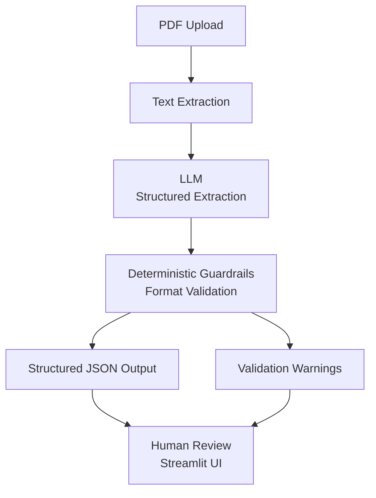

# SDS PDF Extractor

> **LLM-powered extraction with deterministic guardrails and human-in-the-loop review**

A production-oriented **system** for extracting structured data from Safety Data Sheets (SDS) in PDF format using an LLM **only for extraction**, wrapped with **strict schemas**, **format validation**, and a **review-first UI**.

This is intentionally not a demo and not a prompt toy.
It is designed to be **auditable, predictable, and production-safe**.

---

## Core Design Principles

* **LLMs extract — nothing else**
* **Deterministic code validates formats**
* **No silent correction or inference**
* **All issues surface as warnings**
* **Humans remain the final authority**

If a value is wrong or missing, the system **flags it** — it never invents or "fixes" it.

---

## What This System Does

* Drag & drop SDS PDFs via a Streamlit UI
* Extract structured JSON fields (e.g. product info, composition, hazards, transport)
* Apply **minimal, deterministic guardrails**:

  * CAS number normalization & validation
  * Date validation (`MM-DD-YYYY`)
* Emit **warn-only** validation results
* Export clean JSON for downstream systems

---

## What This System Explicitly Does *Not* Do

* ❌ No hallucinated "fixes"
* ❌ No inferred or fabricated values
* ❌ No schema auto-repair
* ❌ No confidence manipulation
* ❌ No business logic hidden in prompts

This keeps the pipeline **transparent**, **testable**, and **safe to operate at scale**.

---

## System Architecture



---

## Guardrails Implemented

Only **format-level validation** is applied — nothing semantic.

### CAS Numbers

* Normalize unicode dashes → `-`
* Validate format: `#######-##-#`

### Dates

* Enforce `MM-DD-YYYY`
* No conversion
* No comparison logic

### Guardrail Behavior

* **Warn-only**
* Never blocks execution
* Never mutates extracted meaning

Warnings are surfaced in:

```json
meta.validation_warnings
```

---

## Running Locally

### 1. Clone the Repository

```bash
git clone <your-repo-url>
cd <repo-name>
```

### 2. Create & Activate a Virtual Environment

```bash
python -m venv .venv
```

**Windows (PowerShell)**

```powershell
.\.venv\Scripts\Activate.ps1
```

**macOS / Linux**

```bash
source .venv/bin/activate
```

### 3. Install Dependencies

```bash
pip install -r requirements.txt
```

### 4. Configure Environment Variables

Create a `.env` file:

```env
OPENAI_API_KEY=your_api_key_here
```

> `.env` is ignored by git. **Never commit API keys.**

---

## Streamlit Interface (Recommended)

```bash
streamlit run app.py
```

From the browser UI you can:

* Drag & drop SDS PDFs
* View extracted structured JSON
* Review validation warnings
* Download the final JSON output

---

## CLI Usage (Extractor Only)

```bash
python src/main.py path/to/sds.pdf
```

Outputs structured JSON to `stdout` for piping or automation.

---

## Intended Use

This project demonstrates:

* Production-style LLM integration
* Safe extraction patterns
* Deterministic validation around probabilistic models
* Human-in-the-loop review workflows

It is suitable as:

* A foundation for enterprise SDS ingestion
* A reference architecture for LLM extraction systems
* A technical portfolio project focused on **reliability over cleverness**

---

## Philosophy (Why This Exists)

LLMs are powerful — but unreliable without structure.

This system treats LLMs as **components**, not authorities:

* They extract
* Deterministic code validates
* Humans decide

That separation is the difference between a demo and a production system.
